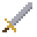
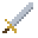
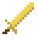
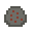
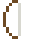
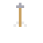

# Rune Valley 64 - Almanac

A quick-reference for all equipment stats and monster stats/loot. This mirrors
the **in-game Almanac** (open the help screen with **Start**, then press **A**
twice).

> Auto-generated from `src/main.c` by `assets/gen_almanac.ps1` - do not edit by
> hand; re-run the script after changing gear, monsters or loot.

---

## Weapons

Worn in the weapon slot. The Magic bonus raises spell accuracy and max hit.

| | Weapon | Attack | Strength | Magic | Defence | Wield level |
|:-:|---|--:|--:|--:|--:|--:|
|  | Wizard staff | +1 | +2 | +12 | +0 | 1 |
|  | Bronze sword | +4 | +3 | +0 | +0 | 1 |
|  | Iron sword | +7 | +6 | +0 | +0 | 1 |
|  | Steel sword | +10 | +9 | +0 | +0 | 20 |
|  | Warlord's Bane | +18 | +17 | +0 | +0 | 20 |
|  | Mithril sword | +14 | +13 | +0 | +0 | 30 |
|  | Rune sword | +20 | +18 | +0 | +0 | 40 |
|  | Dragonfire blade | +22 | +21 | +18 | +2 | 40 |

## Armour

Shields carry a small Attack bonus; wizard gear carries a Magic bonus.

| | Item | Slot | Attack | Defence | Magic | Wield level |
|:-:|---|---|--:|--:|--:|--:|
|  | Bronze helm | Helm | +0 | +3 | +0 | 1 |
|  | Wizard hat | Helm | +0 | +1 | +3 | 1 |
|  | Iron helm | Helm | +0 | +5 | +0 | 10 |
|  | Steel helm | Helm | +0 | +7 | +0 | 20 |
|  | Mithril helm | Helm | +0 | +10 | +0 | 30 |
|  | Rune helm | Helm | +0 | +14 | +0 | 40 |
|  | Bronze shield | Shield | +1 | +5 | +0 | 1 |
|  | Iron shield | Shield | +2 | +8 | +0 | 10 |
|  | Steel shield | Shield | +2 | +11 | +0 | 20 |
|  | Mithril shield | Shield | +3 | +15 | +0 | 30 |
|  | Rune shield | Shield | +4 | +20 | +0 | 40 |
|  | Bronze body | Body | +0 | +8 | +0 | 1 |
|  | Wizard robe | Body | +0 | +2 | +5 | 1 |
|  | Iron body | Body | +0 | +14 | +0 | 10 |
|  | Steel body | Body | +0 | +20 | +0 | 20 |
|  | Mithril body | Body | +0 | +28 | +0 | 30 |
|  | Rune body | Body | +0 | +40 | +0 | 40 |

---

## Monsters & loot

Every monster always drops **bones**. The percentages are a single weighted
roll for the rest of the drop.

### Cow - overworld pasture

Hitpoints **8** | max hit **1** | defence **0**.

| | Drop | Qty | Chance |
|:-:|---|--:|--:|
|  | Cowhide | 1 | 55% |
|  | Coins | 6 | 25% |
|  | Raw shrimp | 1 | 8% |
|  | Nothing | - | 12% |

### Goblin - east of the bridge

Hitpoints **5** | max hit **1** | defence **1**.

| | Drop | Qty | Chance |
|:-:|---|--:|--:|
|  | Coins | 12 | 28% |
|  | Air rune | 3 | 24% |
|  | Raw shrimp | 1 | 16% |
|  | Copper ore | 1 | 12% |
|  | Nothing | - | 20% |

### Skeleton - dungeon floor 1

Hitpoints **9** | max hit **2** | defence **6**.

| | Drop | Qty | Chance |
|:-:|---|--:|--:|
|  | Coins | 30 | 25% |
|  | Fire rune | 2 | 20% |
|  | Air rune | 4 | 15% |
|  | Iron ore | 1 | 13% |
|  | Shrimp | 1 | 12% |
|  | Wizard hat | 1 | 5% |
|  | Nothing | - | 10% |

### Goblin Warlord - boss, dungeon floor 1

Hitpoints **45** | max hit **5** | defence **15**.

**Always pays out (no "nothing").**

| | Drop | Qty | Chance |
|:-:|---|--:|--:|
|  | Coins | 350 | 20% |
|  | Wizard staff | 1 | 14% |
|  | Wizard robe | 1 | 12% |
|  | Wizard hat | 1 | 10% |
|  | Fire rune | 15 | 10% |
|  | Steel body | 1 | 14% |
|  | Mithril helm | 1 | 12% |
|  | Mithril sword | 1 | 8% |

### Wight - dungeon floor 2

Hitpoints **14** | max hit **3** | defence **10**.

| | Drop | Qty | Chance |
|:-:|---|--:|--:|
|  | Coins | 60 | 26% |
|  | Fire rune | 5 | 18% |
|  | Iron bar | 1 | 14% |
|  | Shrimp | 2 | 14% |
|  | Mithril helm | 1 | 4% |
|  | Nothing | - | 24% |

### Demon - boss, dungeon floor 2

Hitpoints **80** | max hit **8** | defence **25**.

**Always pays out (no "nothing").**

| | Drop | Qty | Chance |
|:-:|---|--:|--:|
|  | Coins | 800 | 22% |
|  | Rune sword | 1 | 14% |
|  | Rune helm | 1 | 14% |
|  | Rune shield | 1 | 12% |
|  | Rune body | 1 | 8% |
|  | Fire rune | 30 | 14% |
|  | Mithril body | 1 | 16% |

### Whelp - dungeon floor 3 (the Dragon's brood)

Hitpoints **18** | max hit **4** | defence **12**.

| | Drop | Qty | Chance |
|:-:|---|--:|--:|
|  | Coins | 90 | 26% |
|  | Fire rune | 6 | 20% |
|  | Shrimp | 2 | 16% |
|  | Mithril helm | 1 | 4% |
|  | Nothing | - | 34% |

### Ancient Dragon - boss, dungeon floor 3

Hitpoints **150** | max hit **12** | defence **35**.

**Always drops 2500 coins + a Dragonstone.**

- Fire breath: a ranged attack (up to 5 tiles, ignores armour) for 5 damage, rising to 8 when enraged.
- Enrages at half health: attacks and breathes faster and hits harder.
- On enraging it summons 2 whelps (they vanish and drop nothing on death).

| | Drop | Qty | Chance |
|:-:|---|--:|--:|
|  | Coins | 1500 | 16% |
|  | Rune body | 1 | 12% |
|  | Rune sword | 1 | 11% |
|  | Rune shield | 1 | 10% |
|  | Rune helm | 1 | 10% |
|  | Fire rune | 60 | 11% |
|  | Dragonhide | 2 | 13% |
|  | Dragonstone | 1 | 10% |
|  | Dragonfire blade | 1 | 7% |

---

## Spells

Cast from the spellbook (C-left). Bolts need a Chaos rune on top of their
element; teleports are powered by Law runes (Home uses an Air rune).

| Spell | Magic level | Runes | Max hit |
|---|--:|---|--:|
| Wind Strike | 1 | 1x Air rune | 2 |
| Water Strike | 5 | 1x Water rune | 3 |
| Earth Strike | 9 | 1x Earth rune | 4 |
| Fire Strike | 13 | 1x Fire rune | 5 |
| Earth Bolt | 29 | 3x Earth rune + 1x Chaos rune | 7 |
| Fire Bolt | 35 | 3x Fire rune + 1x Chaos rune | 8 |
| Home Teleport | 1 | 1x Air rune | teleport |
| Bank Teleport | 20 | 1x Law rune | teleport |
| Cave Teleport | 25 | 1x Law rune | teleport |

---

## Ranged

Equip a bow in the weapon slot and carry arrows, then fire at a goblin from up
to five tiles away. Each shot spends one arrow and trains Ranged; accuracy and
max hit add the bow's, the arrow's and your ranged armour's Ranged bonuses.
Bows and arrows are fletched (use a knife on logs). **Mithril arrows need an
oak shortbow or better** - a plain shortbow can't draw them.

| | Bow | Ranged | Wield level |
|:-:|---|--:|--:|
|  | Shortbow | +8 | 1 |
|  | Oak shortbow | +14 | 20 |

| | Arrow | Ranged |
|:-:|---|--:|
|  | Bronze arrow | +3 |
|  | Iron arrow | +7 |
|  | Mithril arrow | +12 |

Ranged armour is crafted (see below) and worn for a Ranged bonus; it needs the
listed Ranged level to wear.

| | Ranged armour | Slot | Ranged | Defence | Ranged level |
|:-:|---|---|--:|--:|--:|
|  | Leather body | Body | +4 | +4 | 1 |
|  | Leather coif | Helm | +2 | +2 | 1 |
|  | D'hide coif | Helm | +5 | +5 | 20 |
|  | D'hide body | Body | +8 | +8 | 30 |

---

## Crafting

Slay cows for **cowhide** (and the Ancient Dragon for **dragonhide**), then
have **Pelt the Tanner** by the cow pasture cure them into leather for a few
coins. Use a **needle** on the leather (with **thread** in your pack) to stitch
ranged armour - both sold at the General Store. Dragonhide gear demands a high
Crafting level but gives the best Ranged bonuses in the valley.

| | Stitch | Materials | Crafting level |
|:-:|---|---|--:|
|  | Leather coif | 1x Leather + 1x Thread | 5 |
|  | Leather body | 3x Leather + 1x Thread | 14 |
|  | D'hide coif | 1x Dragon leather + 1x Thread | 35 |
|  | D'hide body | 2x Dragon leather + 1x Thread | 40 |

---

## Fishing & food

The tackle you carry decides the catch at a fishing spot. Cook the catch on
a fire (it burns until your Cooking level reaches the listed level); eating
the cooked fish restores the listed Hitpoints.

| | Fish | Fishing level | Tackle | Cooking level | Heals |
|:-:|---|--:|---|--:|--:|
|  | Shrimp | 1 | Small net | 34 | 3 |
|  | Trout | 20 | Fishing rod | 40 | 7 |
|  | Lobster | 40 | Lobster pot | 55 | 12 |
|  | Swordfish | 50 | Harpoon | 70 | 16 |

---

## Notes

- **Dragonstone** is a trophy gem worth ~1000 coins at any shop's Sell tab.
- The **Dragonfire blade** is unique and cannot be sold.
- The XP table is the real Old School one (level 99 = 13,034,431 xp).
