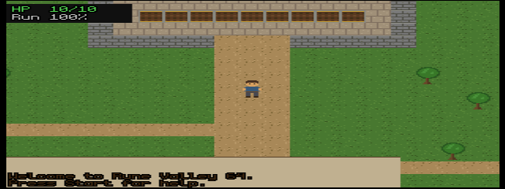

# Rune Valley 64

An original Nintendo 64 homage to Old School RuneScape, built with
[libdragon](https://libdragon.dev/). All code, pixel art, sound effects and
music are original — no Jagex assets are used.



## The game

You wash up in Rune Valley with an axe, a pickaxe, a small net and a
tinderbox. The world runs on a **600 ms game tick**, just like the classic:

- **Woodcutting** — chop trees (and oaks at level 15); trees fall to stumps
  and respawn
- **Mining** — copper and tin near the west path, iron (level 15) further out;
  rocks deplete and respawn
- **Fishing** — net shrimp at the rippling spots along the river
- **Firemaking** — use logs from the inventory with a tinderbox in your pack;
  your character steps politely to the west as the fire catches
- **Cooking** — cook raw shrimp on a fire; burn rates drop as you level
  (never burn again at 34)
- **Combat** — level-2 goblins roam east of the bridge; they are aggressive,
  they hit 1s, and they drop bones
- **The training pasture** — just east of where you wash up, **Sergeant Hardy**
  keeps a fenced field of **cows** and a starter quest, *Basic Training*: fell
  five of them and he drills a jumpstart of combat experience into you. Cows are
  plentiful, never aggressive, barely scratch back, and respawn fast, so the
  herd levels your Attack, Strength and Defence far quicker (and more safely)
  than goblins — a gentle on-ramp before the Warlord and Demon quests ask for
  higher combat levels
- **Prayer** — bury bones for Prayer xp, then spend it: open the prayer book
  (C-down) and toggle combat boosts across four categories — Attack, Strength,
  Defence and Magic. Each category has a basic prayer (Thick Skin, Burst of
  Strength, Clarity of Thought, Mystic Will at +10%) and a high-level upgrade
  (Steel Skin, Ultimate Strength, Incredible Reflexes, Mystic Might at +20%,
  needing Prayer 20–26). Only one prayer per category runs at once, and active
  prayers steadily **drain your prayer points** (you have one per Prayer level).
  Pray at any rune altar — with no essence on you — to top them back up
- **Runecraft** — mine rune essence from the glittering rock in the northwest
  ruins (it never depletes) and bind it at the Air altar beside it, or brave
  the goblin camp to reach the Fire altar (level 14). Runes **stack** in a
  single inventory slot, with the count drawn over the icon
- **Magic** — open the spellbook (C-left) and pick an attack spell: Wind Strike
  (1 air rune), Fire Strike (1 fire rune, Magic 13) or the hard-hitting **Fire
  Bolt** (3 fire runes, Magic 35). With a spell chosen, A flings a bolt at the
  nearest goblin from up to five tiles away, spending its runes and earning
  Magic xp. The spellbook also holds **Home Teleport** (1 air rune) — select it
  to whisk yourself straight back to the surface spawn, your escape hatch from
  the dungeon. You start with 25 air runes to get going; craft more at the altar.
  **Wizard gear** — a staff, hat and robe carry a Magic bonus that boosts your
  spell accuracy and max hit (worn in the weapon/helm/body slots, drawn on your
  character). Win them as **monster drops**
- **Drop tables** — every monster drops bones plus a weighted roll: goblins
  give coins, runes and shrimp, skeletons drop coins, runes, ore and the odd
  wizard hat, and the **Goblin Warlord always pays out** — coins, a staff,
  robe, hat, bars or a fat pile of fire runes. Loot drops straight into your pack
- **The Bazaar** — four market stalls (General Store, Weapon Shop, Armoury,
  Magic Shop) stand in the open field south of the central path. Spend the
  **coins** you earn from drops to buy gear and supplies, or flip to the Sell
  tab (Z) to offload loot for half its value. Your coin balance shows on the
  inventory and shop screens
- **Smithing** — smelt copper + tin into bronze bars at the furnace by the
  mine (iron smelts at 15, and fails half the time, as is tradition), then
  hammer out swords, helms, shields, and platebodies at the anvil. Iron tools
  speed up gathering when carried
- **Equipment** — open the worn-equipment screen (C-up), or press A on gear in
  your inventory to equip it. Four slots — weapon, shield, helm, body — each
  with Attack/Strength/Defence bonuses that feed straight into the combat
  formulas. **Worn gear is drawn on your character** — helm, platebody, sword
  and shield all show on the sprite in every facing
- **Six gear tiers** — bronze and iron are smithed; **steel, mithril and rune**
  are bought at the bazaar or won from the Warlord. Each tier hits harder and
  defends better but demands a higher Attack (weapons) or Defence (armour)
  level to wield — rune needs 40. A full rune set is the late-game coin sink
- **Quests** — *Basic Training*: Sergeant Hardy at the cow pasture wants five
  cows felled, and rewards you with a jumpstart of combat xp (and a few coins).
  *The Chef's Little Problem*: Chef Bouillon by the bank path
  needs 3 goblins bashed and 2 cooked shrimp delivered. And *The Warlord's
  Bane*, a multi-stage epic: Sir Garrick by the cave mouth sends you to scout
  the dungeon (gather 5 bones), forge the legendary **Warlord's Bane** blade
  (2 iron bars + 300 coins), slay the Goblin Warlord with it, and return for
  2000 coins and a mountain of combat xp. You keep the Bane. Then *The Demon
  Below* — a follow-up gated behind it (Attack/Defence/Hitpoints 30): descend
  to the dungeon's second floor and destroy the Demon for 5000 coins and a
  fortune in xp. Track them all in the Quest Journal (Start, then A)
- **The Almanac** — an in-game reference for everything with numbers. Open it
  from the help screen (Start, then A twice) for a scrollable listing of every
  weapon's Attack/Strength/Magic bonuses and level requirement, every piece of
  armour's Defence, and every monster's hitpoints, max hit, defence and full
  **loot table with drop chances**. No wiki required — and the same tables are
  mirrored in [ALMANAC.md](ALMANAC.md) for quick reference out of game
- **A three-floor dungeon** — find the cave stairs in the open field southwest
  of the mine and descend into the gloom. **Floor 1**: tougher **skeletons**
  and the hulking **Goblin Warlord** (45 HP) in the chamber beyond the doorway.
  A sealed stair in his chamber leads to **Floor 2**: undead **wights** and the
  fearsome **Demon** (80 HP, hits for 8). Beat the Demon and a final stair opens
  in its chamber, down to **Floor 3** — the lair of the **Ancient Dragon**
  (150 HP). The Dragon is the deepest, deadliest fight in the valley: it
  **breathes fire from across the room** (armour won't stop it — bring food),
  it **enrages at half health** to strike faster and hit harder, and when it
  does it **summons a brood of whelps** (the floor's red-scaled fodder) to swarm
  you. Fell it for the richest haul in the game — a guaranteed hoard of coins
  and a **Dragonstone**, plus rune gear and a fat roll besides, and a rare
  (~7%) chance at its unique: the **Dragonfire blade**, the best weapon in the
  valley and a true hybrid — top melee bonuses *and* a hefty Magic bonus, so it
  hits hardest in your hand whether you swing it or sling spells with it. Each
  boss pours out combat xp. Come armoured in rune, prayed-up, and well fed — and
  if you fall, you wake safely back on the surface
- **Banking** — a bank with deposit-all and per-item withdrawal sits at the
  north end of the path
- **Hitpoints** start at level 10, regenerate 1 per minute, and shrimp heal 3
- The **XP table is the real one** (level 99 = 13,034,431 xp — good luck on a
  cartridge)
- Run energy drains while running and recharges while you walk or stand

Level-ups play an original fanfare and print the classic congratulations to
the parchment chatbox.

The valley is populated by five **player bots** — fellow adventurers with
era-appropriate names who wander between trees, rocks and fishing spots,
deplete resources you were walking toward, advertise dubious services in
public chat, and say "gz" when you level up near them. They also make bank
runs through the front door and light campfires you can cook on.

The game opens on a **title screen** (the valley lives behind it) and saves
to **cartridge EEPROM**: silent autosave every minute, plus saves on bank
visits and death. The title offers Continue when a valid save exists.

## Controls

| Input | Action |
|---|---|
| Stick / D-Pad | Walk |
| R | Toggle run |
| A | Interact: chop / mine / fish / cook / bank / attack |
| B | Inventory (A: use/eat/bury/light/equip, C-down: drop) |
| C-right | Skills panel |
| C-up | Worn equipment (A: unequip) |
| C-left | Spellbook (A: choose spell / cast Home Teleport) |
| C-down | Prayer book (A: toggle prayer) |
| Start | Help (A: Quest Journal, then A: Almanac) |
| L | Music on/off |

## Building

Prebuilt toolchain + MSYS2 live in `tools/` (not checked in). To reproduce:

1. Install the [libdragon prebuilt MIPS64 toolchain](https://github.com/DragonMinded/libdragon/releases/tag/toolchain-continuous-prerelease)
   and set `N64_INST` to its root.
2. Build & install libdragon (`make install tools-install` in the libdragon
   repo, under an MSYS2/MinGW64 or Linux shell).
3. Generate assets (Windows PowerShell):
   `assets/genart.ps1` (pixel art) and `assets/gensfx.ps1` (audio synth).
4. `make` — produces `runevalley.z64`.

The ROM runs in [ares](https://ares-emu.net/), simple64, or on real hardware
via an EverDrive/SC64 flashcart.

## Layout

```
src/main.c        the whole game: map, ticks, skills, combat, UI, renderer
assets/genart.ps1 ASCII-grid -> PNG pixel art generator (System.Drawing)
assets/gensfx.ps1 SFX + 16-bar music loop synthesizer (embedded C#)
Makefile          libdragon n64.mk build: PNG->sprite, WAV->wav64, DFS, Z64
```
